# Otsuka & Holmusk

## Problem Statement

For this data challenge, you are given a real-world dataset from electronic health records of a patient diagnosed with a specific condition and prescribed either Drug A or Drug B for the treatment. The patients are then monitored for the occurrence of a specific event after the start of the treatment.

The following CSV files are provided:
  + **Patient_characteristics.csv**<br>Contains the information about sociodemographic of patients, diagnosis, lab values, and other existing therapies patients are on.
  + **Event_duration.csv**<br>Contains information about if the event happened to a patient or if the patient was censored and the durations for each case from the start of therapy

The goal of the specific task is to compare the real-world efficacy of the two drugs by comparing the risk of events using a method like survival analysis. Do keep in mind that as this data comes from EHR and not a clinical trial, the two groups may not have balanced patient characteristics which may confound the results of your analysis. You may also have to think about how you would measure and reduce the impact of this confounding in your analysis approach.


```python
## Importing libs.
from sklearn.preprocessing import PolynomialFeatures
from sklearn.linear_model import LinearRegression
from matplotlib.pyplot import pie, axis, show
from scipy.stats import chi2_contingency
from lifelines import KaplanMeierFitter
from sklearn.metrics import r2_score
from pymatch.Matcher import Matcher
from lifelines import CoxPHFitter
from scipy.stats import shapiro
from scipy.stats import pearsonr
import matplotlib.pyplot as plt
from scipy import stats
import seaborn as sns
import random as rn
import pandas as pd
import numpy as np
import collections
import matplotlib
import warnings
import math
%matplotlib inline
```

#### Functions


```python
def counter(x):
    count = {}
    for i in x:
        if i not in count:
            count[i] = 1
        else:
            count[i] +=1
    return(count)
```

## Reading data and formating


```python
## Reading data.
Duration_df = pd.read_csv("./RWD_Efficacy/Biostats/Event_duration.csv")
Characts_df = pd.read_csv("./RWD_Efficacy/Biostats/Patient_characteristics.csv")
sns.set_theme()


## Renaming columns
Characts_df.columns =   list(['Id', 'Drug-Patien_Char', 'Sex', 'Age']+ ['O_Drugs_'+str(i+1) for i in range(8)] + 
                        ['Diag_'+str(i+1) for i in range(15)] + ['Lab_'+str(i+1) for i in range(8)] + 
                        ['Diag_Score_'+str(i+1) for i in range(2)])
Duration_df.columns = ['Id','Bleeding', 'Years', 'Drug-Event_dur']


## Adding extra columns
Duration_df['Id'] = ['Id_'+f'{i+1:05}' for i in Duration_df['Id']]
Duration_df['Bleed'] = ['Bleed' if i == 1 else 'No_Bleed' for i in Duration_df.Bleeding]
Characts_df['Sex_n'] = ['Male' if i == 1 else 'Female' for i in Characts_df.Sex]


## Checking for missing values
plt.subplots(figsize=(9,5))
sns.heatmap(Characts_df.isnull(), cbar=False, cmap="tab20").set_title('DataSet completeness\nPatient_characteristics.csv')
plt.subplots(figsize=(1,5))
sns.heatmap(Duration_df.isnull(), cbar=False, cmap="tab20").set_title('DataSet completeness\nEvent_duration.csv')
plt.show()


#Removing patients that do not have an ID
Characts_df = Characts_df.dropna(subset=['Id'])
Characts_df['Id'] = ['Id_'+f'{int(i)+1:05}' for i in Characts_df['Id']]


#Merging both dataframes
  #"inner" flag ignores all entries that are not shared in both dataframes. 
Merged_df = Characts_df.merge(Duration_df, how = 'inner', on = ['Id'])
Merged_df['Bleeding_t'] = Merged_df['Years']*365 
Merged_df = Merged_df.drop(columns='Years',)


#Checking for % of missing instances
print('Event_duration.csv # of instances before filtering: {}.'.format(Duration_df.shape[0]))
print('Patient_characteristics.csv # of instances before filtering: {}.'.format(Characts_df.shape[0]))
print('After merging, instances = {}; {}% of the original data.'.format(Merged_df.shape[0],
                                                              round(Merged_df.shape[0]/Characts_df.shape[0]*100,1)))

#Removing redundancy
# Comaparing if same drug was administered: 
if counter(Merged_df['Drug-Patien_Char'] == Merged_df['Drug-Event_dur']): 
    print('No diference in administered drug.')
    Merged_df = Merged_df.drop(columns = 'Drug-Event_dur')
    Merged_df = Merged_df.rename(columns={'Drug-Patien_Char': 'Drug'})

```


    
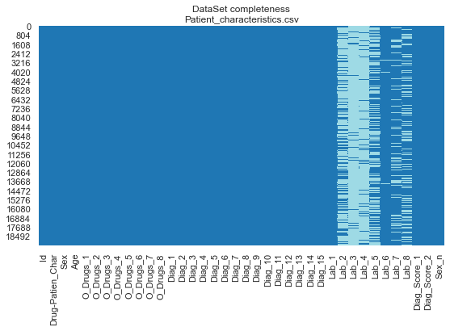
    


    
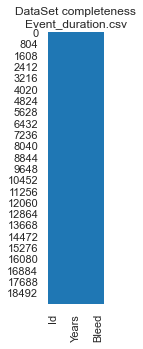
    


    Event_duration.csv # of instances before filtering: 19284.
    Patient_characteristics.csv # of instances before filtering: 19284.
    After merging, instances = 19284; 100.0% of the original data.
    No diference in administered drug.
    

## Binning and creating categories


```python
Treatments = []
tmp = np.asanyarray(Merged_df[['O_Drugs_'+str(i+1) for i in range(8)]]) #Df of experiments 
treatments = {'O_Drugs_'+str(i+1):[] for i in range(8)}
for j,i in enumerate(tmp):
    t = counter(i)
    if 'Yes' not in t:   #If it is only No
        Treatments.append('No')
    elif t['Yes'] == 1:
        Treatments.append('Drug-'+str(list(i).index('Yes')+1))
    else:
        Treatments.append('Drugs>2')

Merged_df['Treatments'] = Treatments


Diagnostics = []
tmp = np.asanyarray(Merged_df[['Diag_'+str(i+1) for i in range(15)]]) #Df of experiments 
diagnostics = {'Diag_'+str(i+1):[] for i in range(15)}
for j,i in enumerate(tmp):
    t = counter(i)
    if 'Yes' not in t:   #If it is only No
        Diagnostics.append('No_diagnosis')
    elif t['Yes'] == 1:
        Diagnostics.append('Diag_'+str(list(i).index('Yes')+1))
    else:
        Diagnostics.append('Diag>2')

Merged_df['Diagnostics'] = Diagnostics
Merged_df['Bleeding_month'] = np.ceil(Merged_df.Bleeding_t/30)


Merged_df = Merged_df[Merged_df['Age'] > 19] #Only one observation corresponding to this bin. Removed it.

Merged_df['Age'] = [int(i) for i in Merged_df['Age']]
Merged_df['Age_bin'] = pd.cut(x=Merged_df['Age'], bins=range(19,109+10,10), 
                        labels = ['20-29', '30-39', '40-49', '50-59', '60-69', '70-79', '80-89', '90-99', '100-109'])

Merged_df['Drug_&_Sex'] = Merged_df['Drug'] + '-' +  Merged_df['Sex_n'] 
Merged_df['Drug_&_Bleeding'] = Merged_df['Drug'] + '-' +  Merged_df['Bleed'] 
```


```python
Merged_df.head()
```


<div>
<style scoped>
    .dataframe tbody tr th:only-of-type {
        vertical-align: middle;
    }

    .dataframe tbody tr th {
        vertical-align: top;
    }

    .dataframe thead th {
        text-align: right;
    }
</style>
<table border="1" class="dataframe">
  <thead>
    <tr style="text-align: right;">
      <th></th>
      <th>Id</th>
      <th>Drug</th>
      <th>Sex</th>
      <th>Age</th>
      <th>O_Drugs_1</th>
      <th>O_Drugs_2</th>
      <th>O_Drugs_3</th>
      <th>O_Drugs_4</th>
      <th>O_Drugs_5</th>
      <th>O_Drugs_6</th>
      <th>...</th>
      <th>Sex_n</th>
      <th>Bleeding</th>
      <th>Bleed</th>
      <th>Bleeding_t</th>
      <th>Treatments</th>
      <th>Diagnostics</th>
      <th>Bleeding_month</th>
      <th>Age_bin</th>
      <th>Drug_&amp;_Sex</th>
      <th>Drug_&amp;_Bleeding</th>
    </tr>
  </thead>
  <tbody>
    <tr>
      <th>0</th>
      <td>Id_00001</td>
      <td>Drug_A</td>
      <td>1</td>
      <td>86</td>
      <td>No</td>
      <td>No</td>
      <td>No</td>
      <td>No</td>
      <td>No</td>
      <td>No</td>
      <td>...</td>
      <td>Male</td>
      <td>0</td>
      <td>No_Bleed</td>
      <td>7.0</td>
      <td>Drug-8</td>
      <td>Diag&gt;2</td>
      <td>1.0</td>
      <td>80-89</td>
      <td>Drug_A-Male</td>
      <td>Drug_A-No_Bleed</td>
    </tr>
    <tr>
      <th>1</th>
      <td>Id_00002</td>
      <td>Drug_A</td>
      <td>2</td>
      <td>66</td>
      <td>No</td>
      <td>No</td>
      <td>Yes</td>
      <td>No</td>
      <td>No</td>
      <td>Yes</td>
      <td>...</td>
      <td>Female</td>
      <td>1</td>
      <td>Bleed</td>
      <td>42.0</td>
      <td>Drugs&gt;2</td>
      <td>Diag&gt;2</td>
      <td>2.0</td>
      <td>60-69</td>
      <td>Drug_A-Female</td>
      <td>Drug_A-Bleed</td>
    </tr>
    <tr>
      <th>2</th>
      <td>Id_00003</td>
      <td>Drug_A</td>
      <td>2</td>
      <td>80</td>
      <td>No</td>
      <td>Yes</td>
      <td>Yes</td>
      <td>No</td>
      <td>No</td>
      <td>No</td>
      <td>...</td>
      <td>Female</td>
      <td>0</td>
      <td>No_Bleed</td>
      <td>61.0</td>
      <td>Drugs&gt;2</td>
      <td>Diag&gt;2</td>
      <td>3.0</td>
      <td>80-89</td>
      <td>Drug_A-Female</td>
      <td>Drug_A-No_Bleed</td>
    </tr>
    <tr>
      <th>3</th>
      <td>Id_00004</td>
      <td>Drug_A</td>
      <td>1</td>
      <td>83</td>
      <td>No</td>
      <td>No</td>
      <td>No</td>
      <td>No</td>
      <td>No</td>
      <td>No</td>
      <td>...</td>
      <td>Male</td>
      <td>0</td>
      <td>No_Bleed</td>
      <td>1.0</td>
      <td>Drug-7</td>
      <td>No_diagnosis</td>
      <td>1.0</td>
      <td>80-89</td>
      <td>Drug_A-Male</td>
      <td>Drug_A-No_Bleed</td>
    </tr>
    <tr>
      <th>4</th>
      <td>Id_00005</td>
      <td>Drug_B</td>
      <td>2</td>
      <td>82</td>
      <td>No</td>
      <td>No</td>
      <td>No</td>
      <td>No</td>
      <td>No</td>
      <td>No</td>
      <td>...</td>
      <td>Female</td>
      <td>0</td>
      <td>No_Bleed</td>
      <td>77.0</td>
      <td>Drug-8</td>
      <td>Diag_13</td>
      <td>3.0</td>
      <td>80-89</td>
      <td>Drug_B-Female</td>
      <td>Drug_B-No_Bleed</td>
    </tr>
  </tbody>
</table>
<p>5 rows × 47 columns</p>
</div>


### Merging tables


```python
plt.subplots(figsize=(10,5))
sns.heatmap(Merged_df.isnull(), cbar=False, cmap="tab20").set_title('DataSet completeness\nPatient_characteristics & Event_duration merge')
plt.show()
```


    
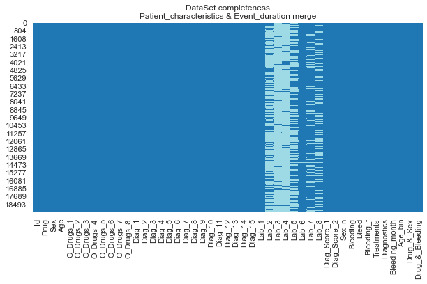
    


## Exploring dataset characteristics:
### Observing dataset proportions 


```python
new_cmap   = np.array(plt.get_cmap('tab10').colors)
cmap_test  = new_cmap[1:]
CustomCmap = matplotlib.colors.ListedColormap(cmap_test)

sizes     = [(8,8),(6,6), (4,4),(4,4)]
Titles    = ['Taking other drugs.\n{} observations'.format(Merged_df.shape[0]),
              'Age proportion\n{} observations'.format(Merged_df.shape[0]),
              'Drug taken\n{} observations'.format(Merged_df.shape[0]),
              'Gender prortion\n{} observations'.format(Merged_df.shape[0])]
colormaps = [np.array(plt.get_cmap('tab10').colors), np.array(plt.get_cmap('Set2').colors),
            np.array(plt.get_cmap('Set3').colors), np.array(plt.get_cmap('Pastel1').colors)]
explodes  = [.07,0,0,0]

for i,col in enumerate(['Treatments','Age_bin', 'Drug', 'Sex_n']):
    plt.figure(figsize = sizes[i])
    a = Merged_df[col].value_counts()
    labels = list(a.index)
    vals   = list(a)
    myexplode = [explodes[i]]+[0]*(len(vals)-1)
    plt.pie(vals, labels = labels, explode = myexplode, autopct='%1.2f%%', colors = colormaps[i], shadow=True)
    plt.title(Titles[i])
    plt.show() 
```


    
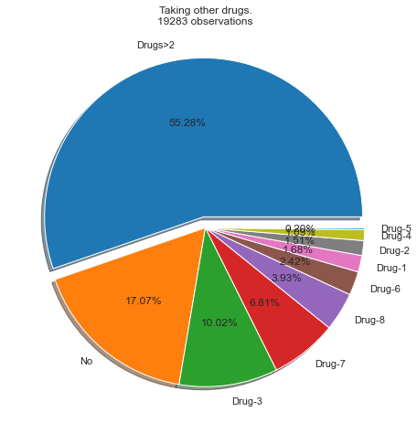
    


    
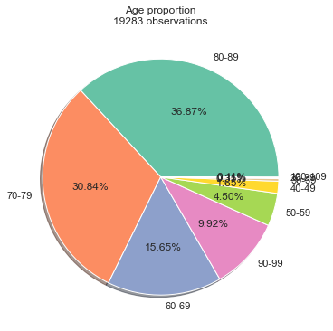
    


    
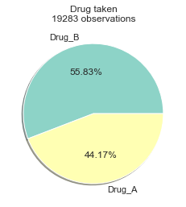
    


    
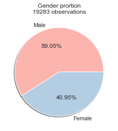
    


### Observing data distribution


```python
Drug_A_df = Merged_df[Merged_df['Drug'] == 'Drug_A']
Drug_B_df = Merged_df[Merged_df['Drug'] == 'Drug_B']

#Measuring the effects of laboratory measurments. 
feature_cols = ['Bleeding']+ ['Lab_'+str(i+1) for i in range(8)]
Drug_A_df.fillna(Drug_A_df.mean(), inplace=True)
correlation = Drug_A_df[feature_cols].corr()
plt.figure(figsize=(10, 7))
sns.heatmap(correlation, annot = True, fmt='.1')
plt.show()

feature_cols = ['Lab_'+str(i+1) for i in range(8)] + ['Bleeding']
Drug_B_df.fillna(Drug_B_df.mean(), inplace=True)
correlation = Drug_B_df[feature_cols].corr()
plt.figure(figsize=(10, 7))
sns.heatmap(correlation, annot = True, fmt='.1')
plt.show()

completeness  = pd.DataFrame(Merged_df[['Lab_'+str(i+1) for i in range(8)]].count()/Merged_df.shape[0])
completeness.rename(columns={0:'Completeness'}, inplace=True)
completeness
```

    c:\users\deg17\.conda\envs\py36\lib\site-packages\pandas\core\series.py:4523: SettingWithCopyWarning: 
    A value is trying to be set on a copy of a slice from a DataFrame
    
    See the caveats in the documentation: https://pandas.pydata.org/pandas-docs/stable/user_guide/indexing.html#returning-a-view-versus-a-copy
      downcast=downcast,
    


    
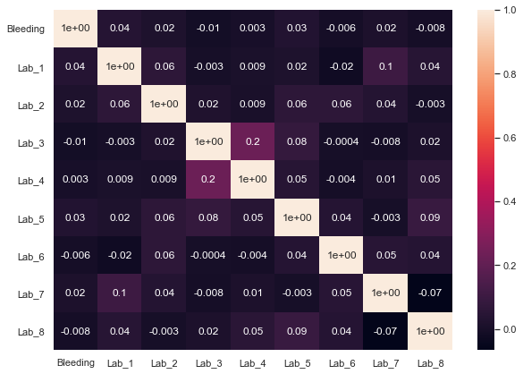
    


    
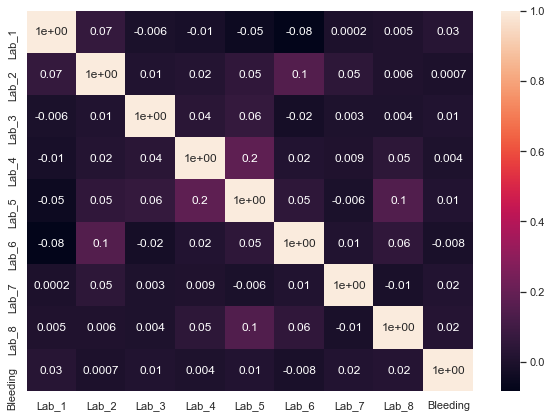
    


<div>
<style scoped>
    .dataframe tbody tr th:only-of-type {
        vertical-align: middle;
    }

    .dataframe tbody tr th {
        vertical-align: top;
    }

    .dataframe thead th {
        text-align: right;
    }
</style>
<table border="1" class="dataframe">
  <thead>
    <tr style="text-align: right;">
      <th></th>
      <th>Completeness</th>
    </tr>
  </thead>
  <tbody>
    <tr>
      <th>Lab_1</th>
      <td>1.000000</td>
    </tr>
    <tr>
      <th>Lab_2</th>
      <td>0.344915</td>
    </tr>
    <tr>
      <th>Lab_3</th>
      <td>0.059690</td>
    </tr>
    <tr>
      <th>Lab_4</th>
      <td>0.119224</td>
    </tr>
    <tr>
      <th>Lab_5</th>
      <td>0.519992</td>
    </tr>
    <tr>
      <th>Lab_6</th>
      <td>0.989887</td>
    </tr>
    <tr>
      <th>Lab_7</th>
      <td>0.828346</td>
    </tr>
    <tr>
      <th>Lab_8</th>
      <td>0.697454</td>
    </tr>
  </tbody>
</table>
</div>


## Cohort balancing
### Finding covariates


```python
All_df = Merged_df.copy()

All_data_num = All_df.replace('No',0)
All_data_num = All_data_num[(All_data_num['Treatments']!='O_Drugs_5') | (All_data_num['Treatments']!='O_Drugs_4')]
All_data_num = All_data_num.replace('Yes',1)
All_data_num = All_data_num[All_data_num['Treatments']!='Two or more drugs']
All_data_num = All_data_num.replace('Drug_A',1)
All_data_num = All_data_num.replace('Drug_B',0)
All_data_num.rename(columns = {'Drug':'Drug_A'})

Cols = ['Drug','Bleeding_t','Sex', 'Age', 'O_Drugs_1', 'O_Drugs_2', 'O_Drugs_3',
       'O_Drugs_4', 'O_Drugs_6', 'O_Drugs_7', 'O_Drugs_8',
       'Diag_1', 'Diag_2', 'Diag_3', 'Diag_5', 'Diag_6', 'Diag_7',
       'Diag_8', 'Diag_9', 'Diag_10', 'Diag_11', 'Diag_12', 'Diag_13',
       'Diag_14', 'Diag_15', 'Lab_1', 'Lab_2', 'Lab_5',
       'Lab_6', 'Lab_7', 'Lab_8', 'Diag_Score_1', 'Diag_Score_2',
       'Bleeding']


All_data_num_A = All_data_num[All_data_num['Drug']==1]
All_data_num_A = All_data_num_A[Cols[1:]]
All_data_num_A = All_data_num_A.dropna()

All_data_num_B = All_data_num[All_data_num['Drug']==0]
All_data_num_B = All_data_num_B[Cols[1:]]
All_data_num_B = All_data_num_B.dropna()

cph_a = CoxPHFitter()
cph_a.fit(All_data_num_A, duration_col='Bleeding_t', event_col='Bleeding')

cph_b = CoxPHFitter()
cph_b.fit(All_data_num_B, duration_col='Bleeding_t', event_col='Bleeding')

print('\n\n\nDrug A\n\n')
plt.subplots(figsize=(15,15))
sns.set(font_scale = 1.2)
cph_a.plot()
plt.show()

print('\n\n\nDrug B\n\n')
plt.subplots(figsize=(15,15))
sns.set(font_scale = 1.2)
cph_b.plot()
plt.show()

plt.subplots(figsize=(6,8))
print('Significant Drug A')
sign_a = cph_a.summary[cph_a.summary.p <= .05].p
Tmp_a = All_data_num_A[list(sign_a.keys())+['Bleeding_t','Bleeding']].copy()

for i in Tmp_a.columns:
    if i in sign_a:
        new_name = i+'  p val='+str(round(sign_a[i],3))
        Tmp_a.rename(columns={i:new_name}, inplace=True)
        
cph_a = CoxPHFitter()
cph_a.fit(Tmp_a, duration_col='Bleeding_t', event_col='Bleeding')
cph_a.plot()
plt.show()

plt.subplots(figsize=(6,8))
print('Significant Drug B')
sign_b = cph_b.summary[cph_b.summary.p <= .05].p
Tmp_b = All_data_num_B[list(sign_b.keys())+['Bleeding_t','Bleeding']].copy()

for i in Tmp_b.columns:
    if i in sign_b:
        new_name = i+'  p val='+str(round(sign_b[i],3))
        Tmp_b.rename(columns={i:new_name}, inplace=True)
        
cph_b = CoxPHFitter()
cph_b.fit(Tmp_b, duration_col='Bleeding_t', event_col='Bleeding')
cph_b.plot()
plt.show()
```

    
    
    
    Drug A
    
    
    


    
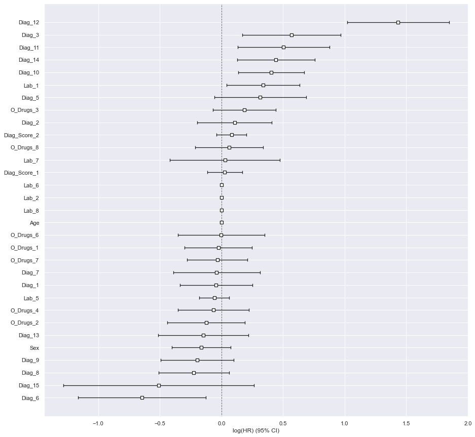
    


    
    
    
    Drug B
    
    
    


    
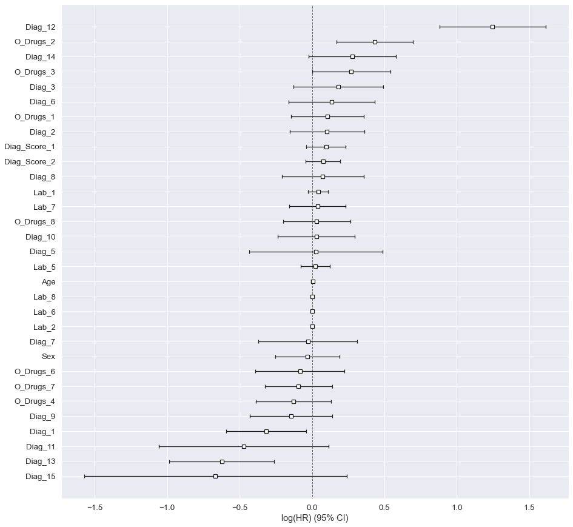
    


    Significant Drug A
    


    
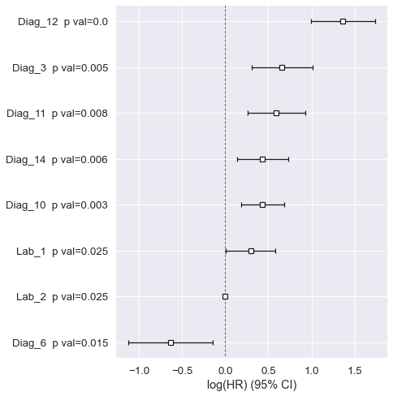
    


    Significant Drug B
    


    
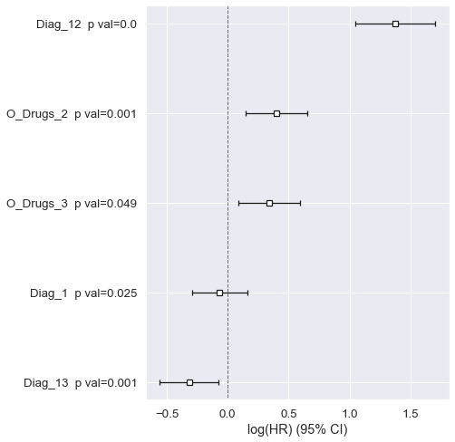
    


### Cohort balancing


```python
#print (str(set(list(sign_b.keys() )+list(sign_a.keys() ))))
Covariates = ['Diag_1', 'Diag_10', 'Diag_11', 'Diag_12', 'Diag_13', 'Diag_14', 'Diag_3', 'Diag_6', 'Lab_1', 'Lab_2',
 'O_Drugs_2', 'O_Drugs_3']

Convention = ['Drug', 'Age', 'Bleeding_t','Bleeding_month', 'Bleeding', 'Sex']
```


```python
warnings.filterwarnings("ignore")

data = Merged_df[Convention+Covariates].copy()
data = data.replace('Yes',1)
data = data.replace('No',0)
data.replace('Drug_A',1, inplace=True)
data.replace('Drug_B',0, inplace=True)
data.fillna(data.mean(), inplace=True)

Category = ['Bleeding_month','Bleeding','Diag_1','Diag_10','Diag_11',
     'Diag_12','Diag_13','Diag_14','Diag_3','Diag_6','O_Drugs_2','O_Drugs_3']
for i in Category: 
    data[i] = data[i].astype("category")
    
    

test = data[data.Drug == 1]
control = data[data.Drug == 0]


m = Matcher(test, control, yvar="Drug", exclude=['Drug'])

# for reproducibility
np.random.seed(17)

m.fit_scores(balance=True, nmodels=100)
```

    Formula:
    Drug ~ Age+Bleeding_t+Bleeding_month+Bleeding+Sex+Diag_1+Diag_10+Diag_11+Diag_12+Diag_13+Diag_14+Diag_3+Diag_6+Lab_1+Lab_2+O_Drugs_2+O_Drugs_3
    n majority: 10766
    n minority: 8517
    Fitting Models on Balanced Samples: 100\100
    Average Accuracy: 58.34%
    

### Comparing among groups (propensity score)


```python
m.predict_scores()
m.plot_scores()
```


    
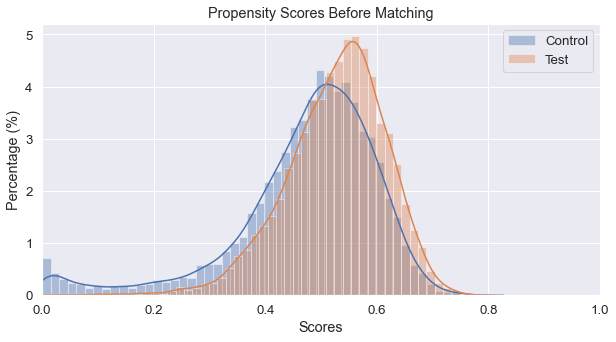
    


### Assesing compromised between number of features and strictness


```python
m.tune_threshold(method='random')
m.match(method="min", nmatches=1, threshold=0.0005)
m.assign_weight_vector()
m.matched_data.sort_values("match_id").head()
```


<div>
<style scoped>
    .dataframe tbody tr th:only-of-type {
        vertical-align: middle;
    }

    .dataframe tbody tr th {
        vertical-align: top;
    }

    .dataframe thead th {
        text-align: right;
    }
</style>
<table border="1" class="dataframe">
  <thead>
    <tr style="text-align: right;">
      <th></th>
      <th>record_id</th>
      <th>weight</th>
      <th>Drug</th>
      <th>Age</th>
      <th>Bleeding_t</th>
      <th>Bleeding_month</th>
      <th>Bleeding</th>
      <th>Sex</th>
      <th>Diag_1</th>
      <th>Diag_10</th>
      <th>...</th>
      <th>Diag_13</th>
      <th>Diag_14</th>
      <th>Diag_3</th>
      <th>Diag_6</th>
      <th>Lab_1</th>
      <th>Lab_2</th>
      <th>O_Drugs_2</th>
      <th>O_Drugs_3</th>
      <th>scores</th>
      <th>match_id</th>
    </tr>
  </thead>
  <tbody>
    <tr>
      <th>0</th>
      <td>0</td>
      <td>1.000000</td>
      <td>1</td>
      <td>86</td>
      <td>7.0</td>
      <td>1.0</td>
      <td>0</td>
      <td>1</td>
      <td>0</td>
      <td>1</td>
      <td>...</td>
      <td>1</td>
      <td>0</td>
      <td>0</td>
      <td>0</td>
      <td>0.974967</td>
      <td>358.572186</td>
      <td>0</td>
      <td>0</td>
      <td>0.568784</td>
      <td>0</td>
    </tr>
    <tr>
      <th>12707</th>
      <td>13777</td>
      <td>0.200000</td>
      <td>0</td>
      <td>63</td>
      <td>0.0</td>
      <td>0.0</td>
      <td>0</td>
      <td>1</td>
      <td>0</td>
      <td>0</td>
      <td>...</td>
      <td>0</td>
      <td>0</td>
      <td>0</td>
      <td>0</td>
      <td>0.725464</td>
      <td>361.209470</td>
      <td>0</td>
      <td>1</td>
      <td>0.568793</td>
      <td>0</td>
    </tr>
    <tr>
      <th>1</th>
      <td>1</td>
      <td>1.000000</td>
      <td>1</td>
      <td>66</td>
      <td>42.0</td>
      <td>2.0</td>
      <td>1</td>
      <td>2</td>
      <td>0</td>
      <td>1</td>
      <td>...</td>
      <td>1</td>
      <td>0</td>
      <td>0</td>
      <td>0</td>
      <td>0.963403</td>
      <td>191.378702</td>
      <td>0</td>
      <td>1</td>
      <td>0.547791</td>
      <td>1</td>
    </tr>
    <tr>
      <th>11428</th>
      <td>12179</td>
      <td>0.333333</td>
      <td>0</td>
      <td>73</td>
      <td>8.0</td>
      <td>1.0</td>
      <td>0</td>
      <td>1</td>
      <td>0</td>
      <td>1</td>
      <td>...</td>
      <td>0</td>
      <td>0</td>
      <td>0</td>
      <td>0</td>
      <td>0.671795</td>
      <td>356.369825</td>
      <td>0</td>
      <td>0</td>
      <td>0.547787</td>
      <td>1</td>
    </tr>
    <tr>
      <th>16560</th>
      <td>18691</td>
      <td>1.000000</td>
      <td>0</td>
      <td>85</td>
      <td>596.0</td>
      <td>20.0</td>
      <td>0</td>
      <td>2</td>
      <td>1</td>
      <td>0</td>
      <td>...</td>
      <td>0</td>
      <td>0</td>
      <td>0</td>
      <td>0</td>
      <td>1.769706</td>
      <td>361.209470</td>
      <td>0</td>
      <td>1</td>
      <td>0.429407</td>
      <td>2</td>
    </tr>
  </tbody>
</table>
<p>5 rows × 22 columns</p>
</div>


    
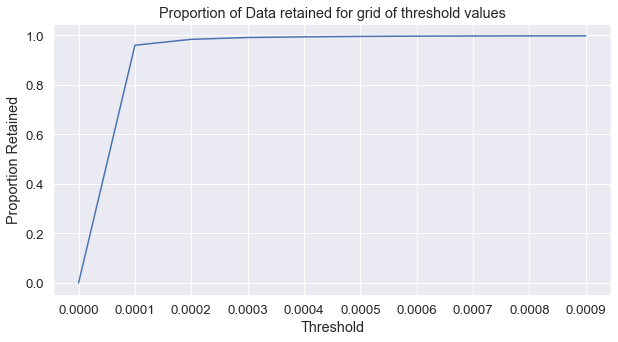
    


### How matching has affected continuous varibles. 


```python
cc = m.compare_continuous(return_table=True)
```


    
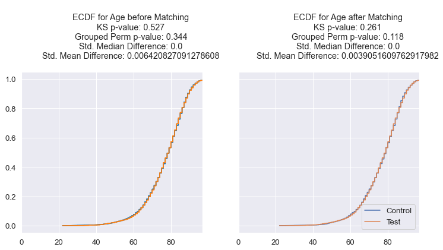
    


    
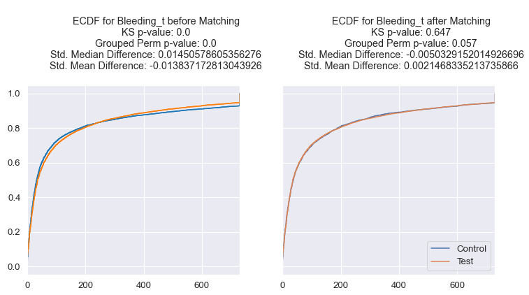
    


    
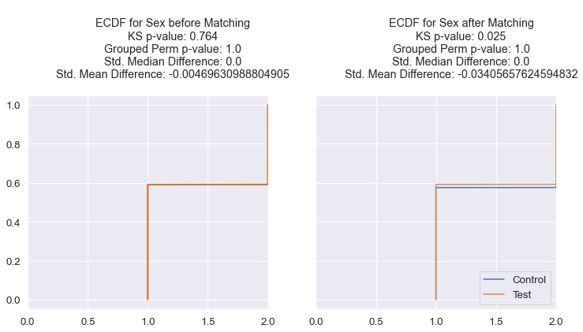
    


    
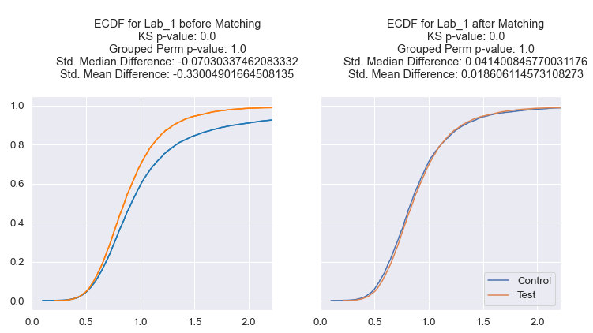
    


    
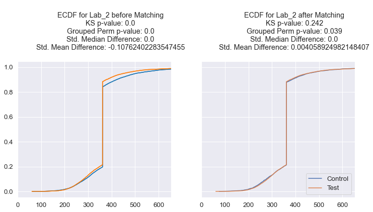
    


### How matching has affected categorical varibles.

This function is broken (not working from  repository). We can assess this but is not strictly necessary. We can check for an overall of how propensity scores have changed after the procedure.

What we are going to do is reproduce the first graph, but now the inputed data is after the whole process.


```python
cc
```


<div>
<style scoped>
    .dataframe tbody tr th:only-of-type {
        vertical-align: middle;
    }

    .dataframe tbody tr th {
        vertical-align: top;
    }

    .dataframe thead th {
        text-align: right;
    }
</style>
<table border="1" class="dataframe">
  <thead>
    <tr style="text-align: right;">
      <th></th>
      <th>var</th>
      <th>ks_before</th>
      <th>ks_after</th>
      <th>grouped_chisqr_before</th>
      <th>grouped_chisqr_after</th>
      <th>std_median_diff_before</th>
      <th>std_median_diff_after</th>
      <th>std_mean_diff_before</th>
      <th>std_mean_diff_after</th>
    </tr>
  </thead>
  <tbody>
    <tr>
      <th>0</th>
      <td>Age</td>
      <td>0.527</td>
      <td>0.261</td>
      <td>0.344</td>
      <td>0.118</td>
      <td>0.000000</td>
      <td>0.000000</td>
      <td>0.006421</td>
      <td>0.003905</td>
    </tr>
    <tr>
      <th>1</th>
      <td>Bleeding_t</td>
      <td>0.000</td>
      <td>0.647</td>
      <td>0.000</td>
      <td>0.057</td>
      <td>0.014506</td>
      <td>-0.005033</td>
      <td>-0.013837</td>
      <td>0.002147</td>
    </tr>
    <tr>
      <th>2</th>
      <td>Sex</td>
      <td>0.764</td>
      <td>0.025</td>
      <td>1.000</td>
      <td>1.000</td>
      <td>0.000000</td>
      <td>0.000000</td>
      <td>-0.004696</td>
      <td>-0.034057</td>
    </tr>
    <tr>
      <th>3</th>
      <td>Lab_1</td>
      <td>0.000</td>
      <td>0.000</td>
      <td>1.000</td>
      <td>1.000</td>
      <td>-0.070303</td>
      <td>0.041401</td>
      <td>-0.330049</td>
      <td>0.018606</td>
    </tr>
    <tr>
      <th>4</th>
      <td>Lab_2</td>
      <td>0.000</td>
      <td>0.242</td>
      <td>0.000</td>
      <td>0.039</td>
      <td>0.000000</td>
      <td>0.000000</td>
      <td>-0.107624</td>
      <td>0.004059</td>
    </tr>
  </tbody>
</table>
</div>


```python
m.matched_data.sort_values("match_id").tail()
```


<div>
<style scoped>
    .dataframe tbody tr th:only-of-type {
        vertical-align: middle;
    }

    .dataframe tbody tr th {
        vertical-align: top;
    }

    .dataframe thead th {
        text-align: right;
    }
</style>
<table border="1" class="dataframe">
  <thead>
    <tr style="text-align: right;">
      <th></th>
      <th>record_id</th>
      <th>weight</th>
      <th>Drug</th>
      <th>Age</th>
      <th>Bleeding_t</th>
      <th>Bleeding_month</th>
      <th>Bleeding</th>
      <th>Sex</th>
      <th>Diag_1</th>
      <th>Diag_10</th>
      <th>...</th>
      <th>Diag_13</th>
      <th>Diag_14</th>
      <th>Diag_3</th>
      <th>Diag_6</th>
      <th>Lab_1</th>
      <th>Lab_2</th>
      <th>O_Drugs_2</th>
      <th>O_Drugs_3</th>
      <th>scores</th>
      <th>match_id</th>
    </tr>
  </thead>
  <tbody>
    <tr>
      <th>8514</th>
      <td>8514</td>
      <td>1.0</td>
      <td>1</td>
      <td>82</td>
      <td>678.0</td>
      <td>23.0</td>
      <td>1</td>
      <td>1</td>
      <td>1</td>
      <td>0</td>
      <td>...</td>
      <td>0</td>
      <td>1</td>
      <td>0</td>
      <td>1</td>
      <td>1.193941</td>
      <td>361.20947</td>
      <td>1</td>
      <td>1</td>
      <td>0.272722</td>
      <td>8514</td>
    </tr>
    <tr>
      <th>8515</th>
      <td>8515</td>
      <td>1.0</td>
      <td>1</td>
      <td>85</td>
      <td>9.0</td>
      <td>1.0</td>
      <td>0</td>
      <td>1</td>
      <td>0</td>
      <td>0</td>
      <td>...</td>
      <td>1</td>
      <td>0</td>
      <td>0</td>
      <td>0</td>
      <td>0.814004</td>
      <td>385.59960</td>
      <td>0</td>
      <td>1</td>
      <td>0.525157</td>
      <td>8515</td>
    </tr>
    <tr>
      <th>10688</th>
      <td>11214</td>
      <td>0.5</td>
      <td>0</td>
      <td>75</td>
      <td>32.0</td>
      <td>2.0</td>
      <td>0</td>
      <td>2</td>
      <td>0</td>
      <td>0</td>
      <td>...</td>
      <td>0</td>
      <td>0</td>
      <td>0</td>
      <td>0</td>
      <td>0.812931</td>
      <td>361.20947</td>
      <td>0</td>
      <td>0</td>
      <td>0.525147</td>
      <td>8515</td>
    </tr>
    <tr>
      <th>16591</th>
      <td>18742</td>
      <td>1.0</td>
      <td>0</td>
      <td>82</td>
      <td>1.0</td>
      <td>1.0</td>
      <td>0</td>
      <td>1</td>
      <td>1</td>
      <td>0</td>
      <td>...</td>
      <td>0</td>
      <td>0</td>
      <td>0</td>
      <td>0</td>
      <td>1.019519</td>
      <td>361.20947</td>
      <td>0</td>
      <td>1</td>
      <td>0.466737</td>
      <td>8516</td>
    </tr>
    <tr>
      <th>8516</th>
      <td>8516</td>
      <td>1.0</td>
      <td>1</td>
      <td>81</td>
      <td>28.0</td>
      <td>1.0</td>
      <td>0</td>
      <td>2</td>
      <td>0</td>
      <td>0</td>
      <td>...</td>
      <td>0</td>
      <td>0</td>
      <td>0</td>
      <td>0</td>
      <td>0.838422</td>
      <td>361.20947</td>
      <td>0</td>
      <td>1</td>
      <td>0.466739</td>
      <td>8516</td>
    </tr>
  </tbody>
</table>
<p>5 rows × 22 columns</p>
</div>


### Measuring how data changed


```python
Balanced = m.matched_data.copy()
test = Balanced[Balanced.Drug == 1]
control = Balanced[Balanced.Drug == 0]
new = Matcher(test, control, yvar="Drug", exclude=['Drug'])
# for reproducibility
np.random.seed(17)
new.fit_scores(balance=True, nmodels=100)
new.predict_scores()
new.plot_scores()
```

    Formula:
    Drug ~ Age+Bleeding_t+Bleeding_month+Bleeding+Sex+Diag_1+Diag_10+Diag_11+Diag_12+Diag_13+Diag_14+Diag_3+Diag_6+Lab_1+Lab_2+O_Drugs_2+O_Drugs_3
    n majority: 8517
    n minority: 8517
    Fitting Models on Balanced Samples: 100\100
    Average Accuracy: 51.69%
    


    
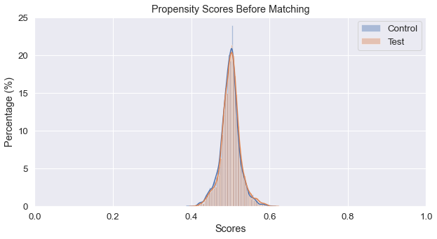
    


```python
data
```


<div>
<style scoped>
    .dataframe tbody tr th:only-of-type {
        vertical-align: middle;
    }

    .dataframe tbody tr th {
        vertical-align: top;
    }

    .dataframe thead th {
        text-align: right;
    }
</style>
<table border="1" class="dataframe">
  <thead>
    <tr style="text-align: right;">
      <th></th>
      <th>Drug</th>
      <th>Age</th>
      <th>Bleeding_t</th>
      <th>Bleeding_month</th>
      <th>Bleeding</th>
      <th>Sex</th>
      <th>Diag_1</th>
      <th>Diag_10</th>
      <th>Diag_11</th>
      <th>Diag_12</th>
      <th>Diag_13</th>
      <th>Diag_14</th>
      <th>Diag_3</th>
      <th>Diag_6</th>
      <th>Lab_1</th>
      <th>Lab_2</th>
      <th>O_Drugs_2</th>
      <th>O_Drugs_3</th>
    </tr>
  </thead>
  <tbody>
    <tr>
      <th>0</th>
      <td>1</td>
      <td>86</td>
      <td>7.0</td>
      <td>1.0</td>
      <td>0</td>
      <td>1</td>
      <td>0</td>
      <td>1</td>
      <td>0</td>
      <td>0</td>
      <td>1</td>
      <td>0</td>
      <td>0</td>
      <td>0</td>
      <td>0.974967</td>
      <td>358.572186</td>
      <td>0</td>
      <td>0</td>
    </tr>
    <tr>
      <th>1</th>
      <td>1</td>
      <td>66</td>
      <td>42.0</td>
      <td>2.0</td>
      <td>1</td>
      <td>2</td>
      <td>0</td>
      <td>1</td>
      <td>0</td>
      <td>0</td>
      <td>1</td>
      <td>0</td>
      <td>0</td>
      <td>0</td>
      <td>0.963403</td>
      <td>191.378702</td>
      <td>0</td>
      <td>1</td>
    </tr>
    <tr>
      <th>2</th>
      <td>1</td>
      <td>80</td>
      <td>61.0</td>
      <td>3.0</td>
      <td>0</td>
      <td>2</td>
      <td>0</td>
      <td>1</td>
      <td>0</td>
      <td>0</td>
      <td>0</td>
      <td>0</td>
      <td>0</td>
      <td>0</td>
      <td>0.826443</td>
      <td>361.209470</td>
      <td>1</td>
      <td>1</td>
    </tr>
    <tr>
      <th>3</th>
      <td>1</td>
      <td>83</td>
      <td>1.0</td>
      <td>1.0</td>
      <td>0</td>
      <td>1</td>
      <td>0</td>
      <td>0</td>
      <td>0</td>
      <td>0</td>
      <td>0</td>
      <td>0</td>
      <td>0</td>
      <td>0</td>
      <td>0.913825</td>
      <td>217.800645</td>
      <td>0</td>
      <td>0</td>
    </tr>
    <tr>
      <th>4</th>
      <td>0</td>
      <td>82</td>
      <td>77.0</td>
      <td>3.0</td>
      <td>0</td>
      <td>2</td>
      <td>0</td>
      <td>0</td>
      <td>0</td>
      <td>0</td>
      <td>1</td>
      <td>0</td>
      <td>0</td>
      <td>0</td>
      <td>0.557880</td>
      <td>361.209470</td>
      <td>0</td>
      <td>0</td>
    </tr>
    <tr>
      <th>...</th>
      <td>...</td>
      <td>...</td>
      <td>...</td>
      <td>...</td>
      <td>...</td>
      <td>...</td>
      <td>...</td>
      <td>...</td>
      <td>...</td>
      <td>...</td>
      <td>...</td>
      <td>...</td>
      <td>...</td>
      <td>...</td>
      <td>...</td>
      <td>...</td>
      <td>...</td>
      <td>...</td>
    </tr>
    <tr>
      <th>19279</th>
      <td>0</td>
      <td>31</td>
      <td>5.0</td>
      <td>1.0</td>
      <td>0</td>
      <td>2</td>
      <td>1</td>
      <td>0</td>
      <td>0</td>
      <td>0</td>
      <td>0</td>
      <td>0</td>
      <td>1</td>
      <td>1</td>
      <td>2.447895</td>
      <td>361.209470</td>
      <td>0</td>
      <td>1</td>
    </tr>
    <tr>
      <th>19280</th>
      <td>1</td>
      <td>82</td>
      <td>678.0</td>
      <td>23.0</td>
      <td>1</td>
      <td>1</td>
      <td>1</td>
      <td>0</td>
      <td>0</td>
      <td>0</td>
      <td>0</td>
      <td>1</td>
      <td>0</td>
      <td>1</td>
      <td>1.193941</td>
      <td>361.209470</td>
      <td>1</td>
      <td>1</td>
    </tr>
    <tr>
      <th>19281</th>
      <td>1</td>
      <td>85</td>
      <td>9.0</td>
      <td>1.0</td>
      <td>0</td>
      <td>1</td>
      <td>0</td>
      <td>0</td>
      <td>0</td>
      <td>0</td>
      <td>1</td>
      <td>0</td>
      <td>0</td>
      <td>0</td>
      <td>0.814004</td>
      <td>385.599600</td>
      <td>0</td>
      <td>1</td>
    </tr>
    <tr>
      <th>19282</th>
      <td>0</td>
      <td>86</td>
      <td>6.0</td>
      <td>1.0</td>
      <td>0</td>
      <td>2</td>
      <td>1</td>
      <td>0</td>
      <td>0</td>
      <td>0</td>
      <td>0</td>
      <td>0</td>
      <td>0</td>
      <td>0</td>
      <td>0.798732</td>
      <td>309.703855</td>
      <td>0</td>
      <td>1</td>
    </tr>
    <tr>
      <th>19283</th>
      <td>1</td>
      <td>81</td>
      <td>28.0</td>
      <td>1.0</td>
      <td>0</td>
      <td>2</td>
      <td>0</td>
      <td>0</td>
      <td>0</td>
      <td>0</td>
      <td>0</td>
      <td>0</td>
      <td>0</td>
      <td>0</td>
      <td>0.838422</td>
      <td>361.209470</td>
      <td>0</td>
      <td>1</td>
    </tr>
  </tbody>
</table>
<p>19283 rows × 18 columns</p>
</div>


```python
new_cmap   = np.array(plt.get_cmap('tab10').colors)
cmap_test  = new_cmap[1:]
CustomCmap = matplotlib.colors.ListedColormap(cmap_test)

sizes     = [(8,8),(6,6), (4,4),(4,4)]
Titles    = ['Taking other drugs.\n{} observations'.format(data.shape[0]),
              'Age proportion\n{} observations'.format(data.shape[0]),
              'Drug taken\n{} observations'.format(data.shape[0]),
              'Gender prortion\n{} observations'.format(data.shape[0])]
colormaps = [np.array(plt.get_cmap('tab10').colors), np.array(plt.get_cmap('Set2').colors),
            np.array(plt.get_cmap('Set3').colors), np.array(plt.get_cmap('Pastel1').colors)]
explodes  = [.07,0,0,0]

for i,col in enumerate(['Drug', 'Sex']):
    plt.figure(figsize = sizes[i])
    a = data[col].value_counts()
    labels = list(a.index)
    vals   = list(a)
    myexplode = [explodes[i]]+[0]*(len(vals)-1)
    plt.pie(vals, labels = labels, explode = myexplode, autopct='%1.2f%%', colors = colormaps[i], shadow=True)
    plt.title(Titles[i])
    plt.show() 
```


    
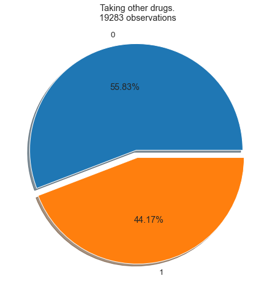
    


    
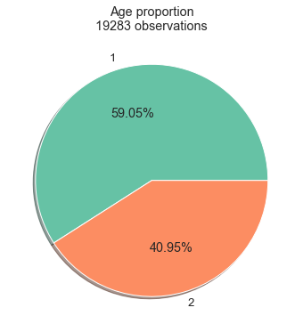
    


```python
kmf = KaplanMeierFitter()
```


```python
#Separating data depending on treatment.
Drug_A_df = data[data['Drug'] == 1]
Drug_B_df = data[data['Drug'] == 0]
Clean_A = Drug_A_df
Clean_B = Drug_B_df
#Measuring bleeding incidence on patients withouth comorbilities and withouth taking other drugs.
tmp = counter(Clean_B.Bleeding)
print('With cohort balancing - Proportion of bleeding patients Drug B {}'.format(tmp[1]/Clean_B.shape[0]))
tmp = counter(Clean_A.Bleeding)
print('With cohort balancing - Proportion of bleeding patients Drug A {}'.format(tmp[1]/Clean_A.shape[0]))


#Separating data depending on treatment.
Drug_A_df = Merged_df[Merged_df['Drug'] == 'Drug_A']
Drug_B_df = Merged_df[Merged_df['Drug'] == 'Drug_B']
Clean_A = Drug_A_df[(Drug_A_df.Diagnostics == 'No_diagnosis') & (Drug_A_df.Treatments == 'No')]
Clean_B = Drug_B_df[(Drug_B_df.Diagnostics == 'No_diagnosis') & (Drug_B_df.Treatments == 'No')]

#Measuring bleeding incidence on patients withouth comorbilities and withouth taking other drugs.
tmp = counter(Clean_B.Bleed)
print('No cohort balancing - Proportion of bleeding patients Drug B {}'.format(tmp['Bleed']/Clean_B.shape[0]))
tmp = counter(Clean_A.Bleed)
print('No cohort balancing - Proportion of bleeding patients Drug A {}'.format(tmp['Bleed']/Clean_A.shape[0]))
```

    With cohort balancing - Proportion of bleeding patients Drug B 0.192550622329556
    With cohort balancing - Proportion of bleeding patients Drug A 0.17658800046964893
    No cohort balancing - Proportion of bleeding patients Drug B 0.14222222222222222
    No cohort balancing - Proportion of bleeding patients Drug A 0.09090909090909091
    


```python
freq = pd.crosstab(data['Drug'], data['Bleeding']) 
c, p, dof, expected = chi2_contingency(freq) 
print(p)
freq

```

    0.004905219580732683
    


<div>
<style scoped>
    .dataframe tbody tr th:only-of-type {
        vertical-align: middle;
    }

    .dataframe tbody tr th {
        vertical-align: top;
    }

    .dataframe thead th {
        text-align: right;
    }
</style>
<table border="1" class="dataframe">
  <thead>
    <tr style="text-align: right;">
      <th>Bleeding</th>
      <th>0</th>
      <th>1</th>
    </tr>
    <tr>
      <th>Drug</th>
      <th></th>
      <th></th>
    </tr>
  </thead>
  <tbody>
    <tr>
      <th>0</th>
      <td>8693</td>
      <td>2073</td>
    </tr>
    <tr>
      <th>1</th>
      <td>7013</td>
      <td>1504</td>
    </tr>
  </tbody>
</table>
</div>


```python
freq = pd.crosstab(data['Bleeding'], data['Drug'], normalize = True) 

sns.heatmap(freq, annot=True)
plt.show()
freq
```


    
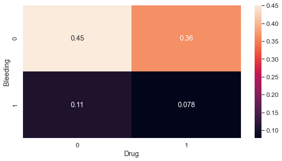
    


<div>
<style scoped>
    .dataframe tbody tr th:only-of-type {
        vertical-align: middle;
    }

    .dataframe tbody tr th {
        vertical-align: top;
    }

    .dataframe thead th {
        text-align: right;
    }
</style>
<table border="1" class="dataframe">
  <thead>
    <tr style="text-align: right;">
      <th>Drug</th>
      <th>0</th>
      <th>1</th>
    </tr>
    <tr>
      <th>Bleeding</th>
      <th></th>
      <th></th>
    </tr>
  </thead>
  <tbody>
    <tr>
      <th>0</th>
      <td>0.450812</td>
      <td>0.363688</td>
    </tr>
    <tr>
      <th>1</th>
      <td>0.107504</td>
      <td>0.077996</td>
    </tr>
  </tbody>
</table>
</div>


### Although small (1.5%) , difference in bleeding incidence is statically significan

## When is bleeding likely to happen?  Kaplan Meier estimate


```python
kmf_a,kmf_b = KaplanMeierFitter(), KaplanMeierFitter()
Estimators = {'Drug_A':kmf_a, 'Drug_B':kmf_b}

Drugs = ['Drug_A', 'Drug_B']
Drug_a = data[data['Drug']==1]
Drug_b = data[data['Drug']==0]

for i,DataSet in enumerate([Drug_a, Drug_b]):
    T = DataSet["Bleeding_t"]
    E = DataSet["Bleeding"]
    Estimators[Drugs[i]].fit(T, event_observed=E, label=Drugs[i])

```


```python
plt.subplots(figsize=(8,6))
Estimators[Drugs[0]].plot_survival_function()
Estimators[Drugs[1]].plot_survival_function()
plt.title('Survival function of both Drugs')
plt.
plt.show()

```


      File "<ipython-input-25-3bae974ee1ce>", line 5
        plt.
            ^
    SyntaxError: invalid syntax
    


### After how long is the the risk equal? 


```python
from lifelines.statistics import survival_difference_at_fixed_point_in_time_test

Survivals  = pd.concat([Estimators['Drug_A'].survival_function_,Estimators['Drug_B'].survival_function_], axis=1)
Survivals.dropna(inplace=True)
Survivals = Survivals.round(3)
Survivals.index = [int(np.round(i)) for i in Survivals.index]
P_vals = []
P_05 = False
P_005= False
for i in Survivals.index:
    results = survival_difference_at_fixed_point_in_time_test(i, Estimators['Drug_A'], Estimators['Drug_B'])
    if results.p_value < 0.05:
        if not P_05:
            P_05 = i
            print(P_05)
    if results.p_value < 0.005:
        if not P_005:
            P_005 = i
            print(P_005)
    P_vals.append(results.p_value)
    
P_vals = P_vals[1:]


print('Maximum difference at day: {}'.format({val:[i] for i,val in enumerate(P_vals)}[min(P_vals)]))
```

### Are the observed changes in the survival times significant?


```python
from lifelines.statistics import logrank_test


results = logrank_test(Drug_a['Bleeding_t'], Drug_b['Bleeding'], Drug_a['Bleeding_t'], Drug_b['Bleeding'], alpha=.99)

results.print_summary()
```


```python

```
